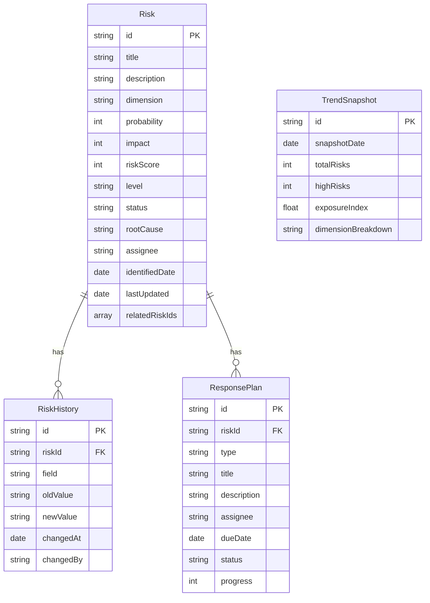

## 1. 架构设计

```mermaid
flowchart TB
    subgraph "前端层"
        "React 18 + Vite" --> "TailwindCSS"
        "React 18 + Vite" --> "Recharts 图表库"
        "React 18 + Vite" --> "Zustand 状态管理"
        "React 18 + Vite" --> "React Router"
    end
    subgraph "数据层"
        "Zustand Store" --> "LocalStorage 持久化"
        "Mock Data" --> "Zustand Store"
    end
    subgraph "外部资源"
        "Google Fonts" --> "DM Sans / Noto Sans SC / JetBrains Mono"
        "Lucide Icons" --> "图标资源"
    end
```

## 2. 技术说明

- **前端框架**：React@18 + TypeScript + Vite
- **样式方案**：TailwindCSS@3 + CSS Variables（主题色系统）
- **图表库**：Recharts（React 生态兼容性好，支持自定义样式）
- **状态管理**：Zustand（轻量、简洁、支持持久化中间件）
- **路由**：React Router v6
- **图标**：Lucide React（线性图标风格，与设计一致）
- **初始化工具**：Vite
- **后端**：无（纯前端，使用 Mock 数据 + LocalStorage 持久化）
- **数据库**：LocalStorage（前端持久化存储）

## 3. 路由定义

| 路由 | 用途 |
|------|------|
| `/` | 重定向至仪表盘 |
| `/dashboard` | 风险总览仪表盘 |
| `/register` | 风险登记册 |
| `/assess` | 风险识别与评估（新建/编辑） |
| `/assess/:id` | 编辑指定风险 |
| `/trends` | 趋势分析中心 |
| `/response` | 响应预案管理 |

## 4. 数据模型

### 4.1 数据模型定义



### 4.2 数据定义

**Risk（风险）**：
- id: 唯一标识，格式 `RSK-{YYYYMMDD}-{序号}`
- dimension: 枚举值 `schedule | resource | requirement | dependency`
- probability/impact: 1-5 整数
- riskScore: probability × impact 自动计算（1-25）
- level: 根据 riskScore 自动映射 `critical(20-25) | high(12-19) | medium(6-11) | low(1-5)`
- status: 枚举值 `identified | assessing | mitigating | monitoring | closed`

**RiskHistory（风险变更历史）**：
- field: 记录变更的字段名
- 支持风险状态、评估值、措施等所有字段的变更追踪

**ResponsePlan（响应预案）**：
- type: 枚举值 `prevention | contingency`
- status: 枚举值 `planned | in_progress | completed | overdue`

**TrendSnapshot（趋势快照）**：
- 每日自动生成一份快照，用于趋势分析
- dimensionBreakdown: JSON 格式存储各维度风险数量

## 5. 关键算法

### 5.1 风险暴露度计算

```
风险暴露度 = Σ(每个风险的 probability × impact × 权重系数) / 风险总数
```

### 5.2 异常波动检测

```
若当周风险暴露度与前4周均值的偏差 > 1.5倍标准差，则标记为异常
```

### 5.3 风险等级映射

| 风险值范围 | 等级 | 颜色 |
|-----------|------|------|
| 20-25 | 极高 | #EF4444 |
| 12-19 | 高 | #F97316 |
| 6-11 | 中 | #EAB308 |
| 1-5 | 低 | #22C55E |

## 6. 项目结构

```
src/
├── components/
│   ├── layout/          # 布局组件（Sidebar, Header）
│   ├── dashboard/       # 仪表盘模块组件
│   ├── register/        # 登记册模块组件
│   ├── assess/          # 评估模块组件
│   ├── trends/          # 趋势分析模块组件
│   └── response/        # 响应预案模块组件
├── stores/              # Zustand 状态管理
│   ├── riskStore.ts     # 风险数据
│   └── uiStore.ts       # UI 状态
├── data/                # Mock 数据
│   └── mockData.ts
├── types/               # TypeScript 类型定义
│   └── index.ts
├── utils/               # 工具函数
│   ├── riskCalc.ts      # 风险计算
│   └── trendAnalysis.ts # 趋势分析
├── pages/               # 页面组件
├── App.tsx
└── main.tsx
```
